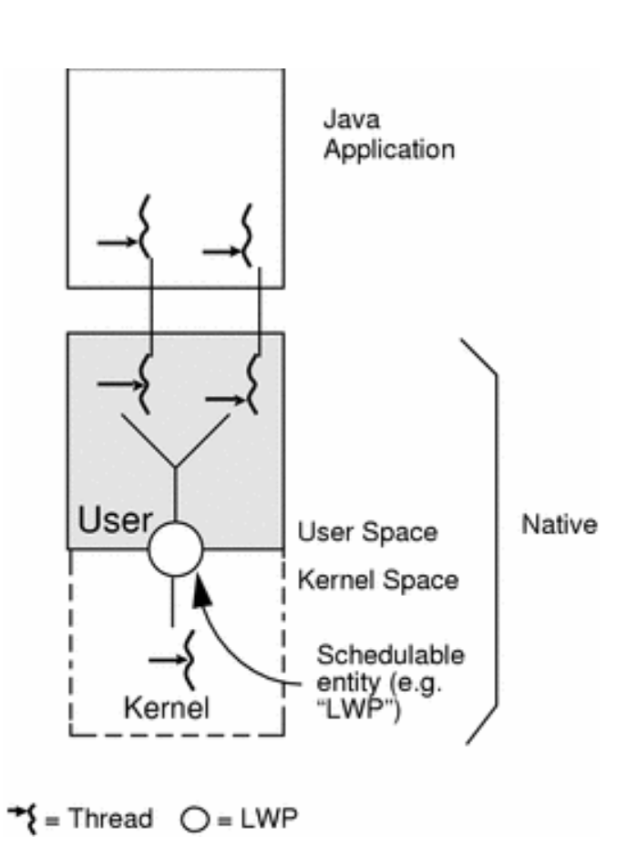

# Multithreading

Multithreading is a model of a program execution, when multiple threads (units of execution) can be created and run independently on each other. Threads share the same resources.

Whether threads share a single resources and run concurrently, or run in parallel is defined by the multutihreding model.

## Multithreading Models

### Many-to-One Model (Green Threads, or Coroutines)

- the application can create any number of threads
- threads are executed concurrently
- threads are restricted to only the user space
- only one of these thread can access the kernel at the time and be scheduled
- provides a limited concurrency and does not exploit multiprocessors



### One-to-One Model

- each user thread created by the application is known to the kernel and all threads can access the kernel at the same time
- the main problem with this model is that each thread creates more "weight" to the process. Hence many OS limit the number of threads supported on the system

### Many-to-Many Model (Java Native Threads)

- it leverages capabilities of the kernel while also enabling creation of thousands of user-level threads
- can take advantage of the multiprocessor environment

## Structured Concurrency

Structured concurrency is a property of concurrent programs, where the lifetimes of concurrent functions are cleanly nested. That is, if a function foo starts running a function bar in the background (bar runs concurrently to foo), then bar must finish before foo completes.

This is however not how a concurrent code is typically written. Whether it is thread, fibers or coroutines, they are spawend in the background without any supervision of or joining.[4]

Structured concurrency specifies that any threads started by a function must complete before the function existes. Also, in structured concurrency thread-related side effects are not permitted. [4]

A pure function can mute a local state but it is not permitted to mutate a global state.

## Multithreading and Java

<!-- 
    - runable and how to run a thread
    - thread pool and scheduled thread pool
    - runnable
    - locks
    - volatile
 -->

### Synchronised and Intrinsic Lock

```Java
 ExecutorService executor = Executors.newFixedThreadPool(2);

IntStream.range(0, 10000)
    .forEach(i -> executor.submit(this::incrementSync));

stop(executor);

System.out.println(count);
```

Synchronised is also available in a block statement

```Java
void incrementSync() {
    synchronized (this) {
        count = count + 1;
    }
}
```

Synchronisation is built around an internal entity known as the **intrinsic lock**, or **lock monitor**. Every object has an intrinsic lock associated with it. If a thread needs an exclusive access to the object, it has to acquire its intrinsic lock before accessing them and release it when it is done. [5]

A thread owns the intrinsic lock after it has acquired it and before it has released the lock. When other thread tries to acquire the lock, or access the object it will be blocked until the lock is released. When a thread invokes a synchronized method, it automatically acquires the intrinsic lock for that method's object and releases it when the method returns. The lock release occurs even if the return was caused by an uncaught exception. [6]

Intrinsic lock has a reentrant characteristics. It means that a thread owning a lock can safely re-acquire it multiple times without the risk of running into the deadlock. [5]

#### Happens Before Relationship

Multi-core processors are able to run multiple threads per core. Each core has number of levels of its own local cache. When a process operates on a shared variables, there can be delay between modifying the variable and when the variable is written to main memory accessible by all threads. This can cause that another thread could access stale value.

This can be observed by following example:

```Java
public class StopThread {
        private static boolean stopRequested;
        public static void main(String[] args)
                throws InterruptedException {
            Thread backgroundThread = new Thread(new Runnable() {
                public void run() {
                    int i = 0;
                    while (!stopRequested)
                        i++;
                }
            });
            backgroundThread.start();
            TimeUnit.SECONDS.sleep(1);
            stopRequested = true;
        }
    }
```

There is no guarantee that the change of the value in “stopRequested” variable (from the main thread) becoming visible to the “backgroundThread” that we created. As the write operation to the “stopRequested” variable to true from the main method is invisible to the “backgroundThread”, it will go into an infinite loop.[7]

The reason can be explain as following:

- The main thread and our “backgroundThread” is running on two different cores inside the processor.
- The “stopRequested” will be loaded into the cache of the core that executes the “backgroundThread”.
- The main thread will keep the updated value of the “stopRequested” value in a cache of a different core. Since now the “stopRequested” value resides in two different caches, the updated value may not be visible to the “backgroundThread”.

To avoid this problem, java has introduced happens-before relationship defined as:

- Two actions can be ordered by a happens-before relationship.
- If one action happens-before another, then the first is visible to and ordered before the second.

According to this, if there is a happens-before relationship between a write and read operation, the results of a write by one thread are guaranteed to be visible to a read by another thread. Therefore, we will be able to maintain the memory consistency if we are able to have the happens-before relationship between our actions.

```Java
public class StopThread {
        private static boolean stopRequested;
        private static synchronized void requestStop() {
            stopRequested = true;
        }
        private static synchronized boolean stopRequested() {
            return stopRequested;
        }
        public static void main(String[] args)
                throws InterruptedException {
            Thread backgroundThread = new Thread(new Runnable() {
                public void run() {
                    int i = 0;
                    while (!stopRequested())
                        i++;
                }
            });
            backgroundThread.start();
            TimeUnit.SECONDS.sleep(1);
            requestStop();
        }
    }
```
## Reference

- [1] Class ReentrantReadWriteLock; <https://docs.oracle.com/javase/7/docs/api/java/util/concurrent/locks/ReentrantReadWriteLock.html>
- [2] Chapter 2 Multithreading; <https://docs.oracle.com/cd/E19455-01/806-3461/6jck06gqe/index.html>
- [3] Process calculus; <https://en.wikipedia.org/wiki/Process_calculus>
- [4] Processes, threads, green threads, protothreads, fibers, coroutines: what's the difference?; <https://stackoverflow.com/questions/3324643/processes-threads-green-threads-protothreads-fibers-coroutines-whats-the>
- [4] Structured concurrency and pure functions; <https://blog.softwaremill.com/structured-concurrency-and-pure-functions-92dd8ed1a9f2>
- [5] Java 8 Concurrency Tutorial: Synchronization and Locks; <https://winterbe.com/posts/2015/04/30/java8-concurrency-tutorial-synchronized-locks-examples/>
- [6] Intrinsic Locks and Synchronization' <https://docs.oracle.com/javase/tutorial/essential/concurrency/locksync.html>
- [7] Handling Java Memory Consistency with happens-before relationship; <https://medium.com/@kasunpdh/handling-java-memory-consistency-with-happens-before-relationship-95ddc837ab13#:~:text=Java%20defines%20a%20happens%2Dbefore,and%20ordered%20before%20the%20second.>