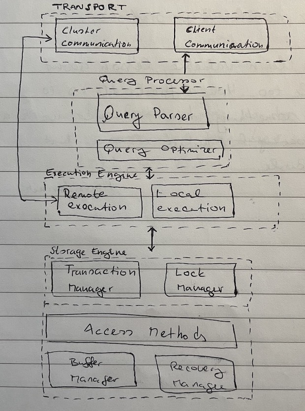
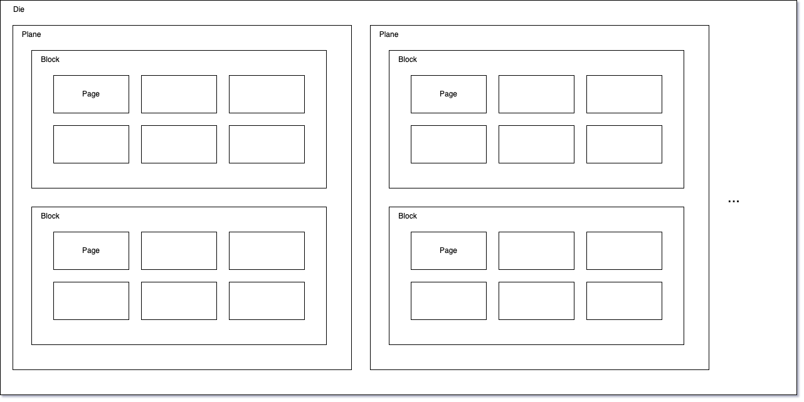

# Database Primer

## Overview

High level DB categories:

- **Online Transaction Processing Database (OLT)**
  - handle large number of short lived queries anad transactions
  - queries are predefined
  - typically can be understood as an operational database
- **Online Analytical Processing Database (OLAP)**
  - handles a comples aggregaction
  - used for analytics and long running ad-hoc queries

### Architecture

### Query Optimizer

- Eliminates impossible and redundant parts of the query
- Attmpts to find the most efficient way to execut the query
  - based on internal statistics e.g. index cardinality, approximate insertion size

### Transaction Manager

- Schedules transacation's execution
- Ensures consistency

## Disk Based Structures

Most databases used today were developed in the time of spinning disks, where the expensive part is seek. Once the page is found, the write or read is relatively cheap.

Sector - the smallest transferable unit on spinning disks. It is between 512 bytes and 4 KB.

### SSD

SSD are often a replacement for spinning disks. The main advantage is that there are no moving parts, what makes the seek significantly faster. Typical SSD is build out of a memory cells as following:

cells -> strings -> arrays -> pages -> blocks

- memory cells are combined into strings
- strings are combined into arrays, typically 32 - 64 cells
- arrays are comibined into pages
- pages are combined into blocks

sizes of these objects vary but their typical values is as following:

- cells = one or multiple bits of data
- page = 2 - 16KB
- block = 64 - 512 pages

The smallest programmable unit is a **page**. The smallest earsable unit is a block

