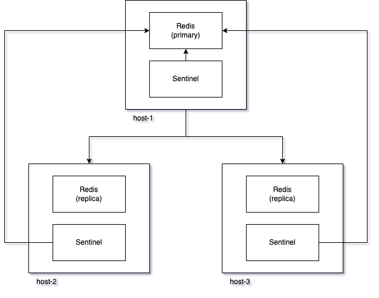

# Redis

Redis is an open source, in-memory key-value.

## Key characteristics

- In memory with optional write to disk
- The maximum allowed size of a key is 512 MB.
- Not strongly consistent
- Highly available
- Horizontally scalable
- Support rich data structures
- Single threaded

## Supported Data Types

- String: a text value
- Hash: A hash table of string keys and values
- List: A list of string values
- Set: A non-repeating list of string values
- Sorted Set: A non-repeating list of string values ordered by a score value
[0]

## Redis Replication

Redis replication provides Redis follower instances to be exact copies of the primary instance. It is due to a primary-replicat pattern. Replicas maintain a persistent connection with the primary. When the network link is broken, they will attempt to re-connect with the master.

Redis uses by default asynchronous replication, which provide low latency and high performance. Replicas acknowlage periodically the data they replicated with master asyncronously.

The result of async replication is that acknowlaged write by the primary can be lost if the primary has failed.

## High Availability (HA)

Redis can be run as a single instance without prividing high availability. Sentinel[2] can be used when HA is required when redis is not using Cluster Redis. In this scenario, there will be a Redis primary and at least one replica. Sentinel is responsible for failover from primary to replica when primary is not available.

Apart of failover it also provides following features:

- monitorit
- alerting
- failover
- configuration provider / discovery - Sentinel acts as a source of authority for clients service discovery. Clients connect to sentinel to get the current primary. After a failover sentinel is responsible for reporting a new address to clients.

In case of failure, ACK-ed writes can be lost due to ASYNC replication between primary and replicas

## Redis Cluster

Redis Cluster enables horizontal scalability. It provides a Redis system that can:

- shard a dataset across multiple partitions
- can tolerate a subset of failing nodes

### Data Sharding

Data is split using a *hash-slot* sharding.

There are 16384 hash slots in Redis Cluster, and to compute the hash slot for a given key, we simply take the CRC16 of the key modulo 16384.

Every node in the cluster is responsible for a subset of the hash slots. For example:

- Node A contains hash slots from 0 to 5500.
- Node B contains hash slots from 5501 to 11000.
- Node C contains hash slots from 11001 to 16383.

When some of the nodes fails, .e.g. Node B, Redis does not have a way how to serve keys in slots 5501 to 11000 and is not able to continue. For this reason, it is recommended to have a replica for each node, e.g. A1, B1 and C1 replicas. When node B failes, node B1 becomes primary and the cluster could continue. There will be another instance of B created to serve as a new replica.  

## Performance

- Being single-threaded, Redis favors fast CPUs with large caches and not many cores.

- With high-end configurations, the number of client connections is also an important factor.
  - Being based on epoll/kqueue, the Redis event loop is quite scalable.
  - Redis has already been benchmarked at more than 60_000 connections, and was still able to sustain 50_000 q/s in these conditions.
  - A rule of thumb, an instance with 30_000 connections can only process half the throughput achievable with 100 connections.
[4]

## MemCache vs Redis

Key difference:

- Redis is singlethreaded and memcache is multithreaded
  - Memcache scales well vertically by adding more cores. Because Redis is singlethreaded adding more cores does not significantly improves its performance
- Redis supports data types and memcache stores only strings
  - Memcache stores strings indexed by a string key
- Memcache limited size of key and values
  - Memcached supports keys with a maximum size of 250B and values up to 1MB[0]
- Memcache does not support horizontal scaling out of the box
- Redis has multiple eviction policies while Memcache has only LRU
  - Redis: No eviction, LRU, Volatile LRU, All keys random, Volatile random, Volatile TTL
  - Volatile policies apply given policy with ability to set expiration time

## Reference

- [0] <https://www.imaginarycloud.com/blog/redis-vs-memcached>
- [1] <https://redis.io/docs/manual/replication/>
- [2] <https://redis.io/docs/manual/sentinel/>
- [3] <https://redis.io/docs/manual/scaling/>
- [4] <https://redis.io/docs/reference/optimization/benchmarks/>
