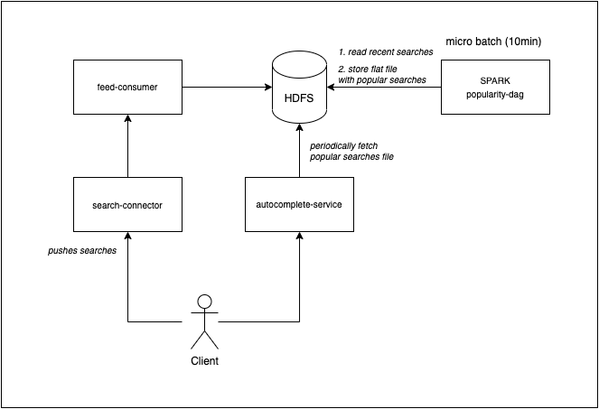

# Search Autocomplete
## Problem
Your search engine became very popular and your product would like to design an autocomplete system.

In order to be relevant, the suggestion needs to happen instantinously

### Hints
- autosuggest based on popularity
- data should not be more stale than 24h
- there is about 5 billion searches a day

### Intuition
- algorithm should use prefix search
- think about size of the search dataset and actual popular phrases dataset
	- how many bytes has a phrase?
	- popular phrases can be relativelly small and fit into the memory
- how fast is instantenious? - it is <150ms p99
	- due to latency requirement and dataset size, it can be stored in the memory

### Considerations
- how to store searches in HDFS?
- how frequently to run the batch and what technology to use for the batch?
	- map reduce vs batch?
- what datastructure to use for storing flat file and what format should it be encoded into?
	- json and parquet, or protobuf
- how the old dataset will be replaced with a new one?

