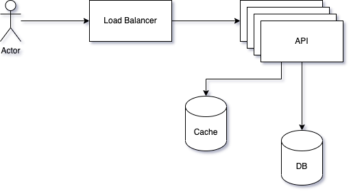

# URL Shortener
## Functional Requirements
- Can you give me example of how the shortener should work?
- What is the traffic volume?
- How long is the shortened URL
	- assume - as short as possible?
- What characters are allowed to be in the shortener?
- Can the shortened URL be deleted or updated?

## Simplified Design
### API
 **`POST api/v1/shorten**

Request:
- origin: string

Example:
```
{"longUrl": "my-long-url"}
```

Reqsponse:
- 200 longUrl: string

**`GET api/v1/redirect/<shortUrl>**

Response:
301 LongUrl




