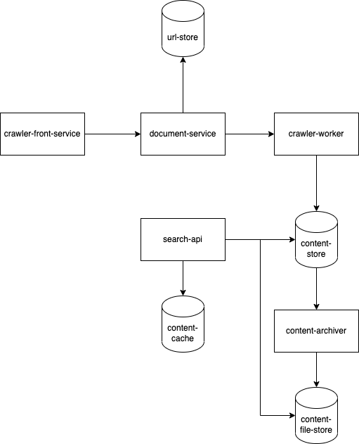

# Web Crawler

## Functional Requirements

Given a URL:
- download all the web pages in that URL
- extract URLs from these webpages
- add new URLs to be downloaded
- repeat above steps

### Questions
- what is the main purpose of the web-crawler?
- how many web pages does the system crawl in month/day?
- what content type is supported? only HTML, or images, videos and pdfs too?
- should we consider newly added, or edited web pages too?
- how should we handle duplicated web pages?
- is there a limit on the URL?

### Estimates
- single page is 500K large

### Werb Crawler Usecases
- Indexing
- archiving
- mining
- monitoring

## High Level Design

### Componenets
#### URL Seed
It is the starting point from where the crawling will start. It is important to choose well the URLs to reach as far as possible.

#### URL Front

#### HTML Downloader
Downloads html content from the web pages

#### Content Parser
Applies validation, filteres out extra large and malicious content and parses webpages into components that will be stored.

#### Content Deduplicator
Remove duplicated webpages. Webpages are compared by comparing their hashes, not content itself for higher efficiency.

#### Content Storage
We need to store content of the pages somewhere. It is unstructured blob of parsed HTML mapped against its URL as a key.

Using NoSQL database would be better option in compare with SQL database.

Further ferformance optimisation would be to keep only the metadata of the webpages in the database and the content on disk as static files. This could be e.g. AWS S3, or GCP Cloud Storage

#### URL Filter
Filters certain URL links pointing to media content (images, videos, pdf, etc)

## System Design

### Website as a DAG - DFS vs BFS
Website has a top domain as root and links follow to the next pages. Each sub-page can be understood as a node and each link as an edge.

There are 2 main ways how to traverse this graph:
- BFS - Breath first search
- DFS - Dept first search

**BFS** is typically a good choice as the DAG can get very deep.

BFS can be implemented using FIFO queue. URL are dequeued in the order as they are enqueued.

### Crawler Front Service

